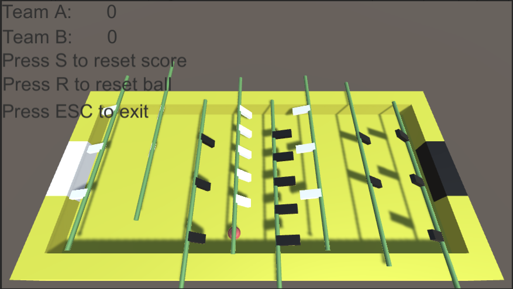

# Table Soccer

A simple Unity implementation of the table soccer game.

The game control is simple, move your mouse left and right, and all the hands rotate.
Move your house up and right, and all the hands shift.
Try to push the ball to the gate of other side.

The computer enemy is vert silly, for now, just repeatedly moving up and down while rotating.
Hope enjoy the game. If you have any suggestion, pull requests are very welcome.

